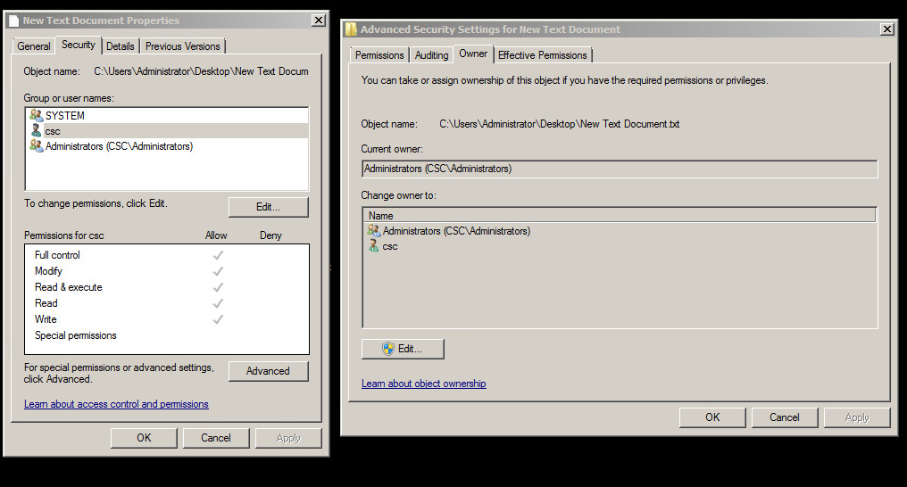

# Windows User Auditing and File Permissions

It is almost guaranteed that during competition you will encounter a Windows machine
with Active Directory. Active Directory handles a large majority of domain controller activity esspecially when it comes to users and computers. This section of the lecture is tailored towards auditing domain users for validity and what to do when action needs to be taken on a user's account. 

**Domain** **Controller** (DC) - The primary server that handles security authentication requests in a domain. 

**Active** **Directory** (AD) - The service that authenticates and authorizes users, tracks groups, enforces security policies, and manages shared storage information. 

Topics:

* Creating users
    * ```win+r + "dsa.msc"```
    * Select Users folder in domain
    * Right click in right panel -> New -> User

* Creating groups
    * ```win+r + "dsa.msc"```
    * Select Users folder in domain
    * Right click in right panel -> New -> Group
  
* Deleting users
    * ```win+r + "dsa.msc"```
    * Select Users folder in domain
    * Right click user -> Delete

* Deleting groups
    * ```win+r + "dsa.msc"```
    * Select Users folder in domain
    * Right click group -> Delete
  
* Disabling users
    * ```win+r + "dsa.msc"```
    * Select Users folder in domain
    * Right click user -> Disable Account

* Moving users to groups
    * ```win+r + "dsa.msc"```
    * Select Users folder in domain
    * Right click user -> Add to a group... -> Type group name -> click Check Names -> Ok

* Fixing locked accounts
    * ```win+r + "dsa.msc"```
    * Select Users folder in domain
    * Right click user -> Properties -> Account -> Check Unlock account

* Verifying accounts
    * Ask the user to verify information you find about them under their Account tab

* Password resets
    * ```win+r + "dsa.msc"```
    * Select Users folder in domain
    * Right click user -> Reset Password...

* Shared folders
    * Remotely accessable folders

* Builtin
    * The set of essential user groups default defined by Active Directory Users and Computers

* Computers
    * Other computers nested within the domain (none for this lab)


## Event Viewer

Event viewer is where you will find entries for windows logs about various events. The level of detail and frequency of logs is dictated by policy settings in Group Policy.

**Group** **Policy** - Centralized management tool for application and user permissions.

Open up Group Policy Management:
```powershell
win+r + gpmc.msc
```

Force Group Policy To Update:
```powershell
PS:\> GPUpdate /force
```

* Audit account management
* Audit logon events
* How values are deleted (database style)

## File Permissions

Windows uses access control lists (ACLs) to keep track of which users/groups are able to perform certain operation on a file or directory. Event viewer will only tell
you a file was handled, it will not give you specifics about the action taken (i.e. it will not tell you if a file was read, written, or executed). Therefore, when establishing permissions on a file, it is best practice to set only the modes that matter.


